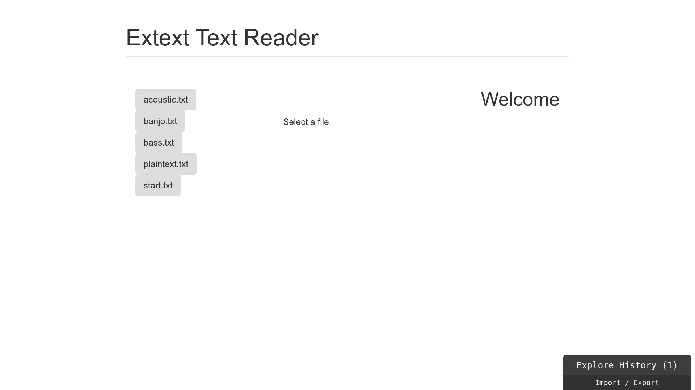
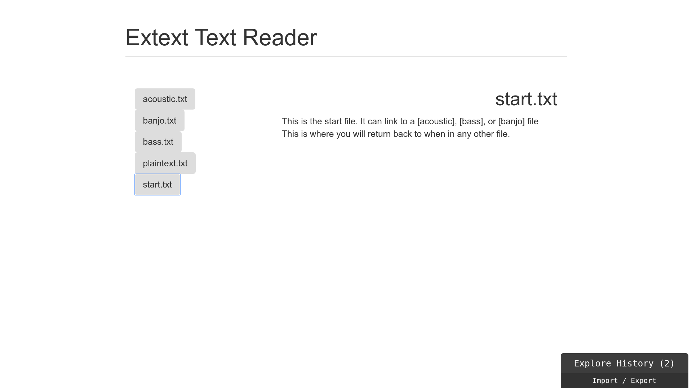
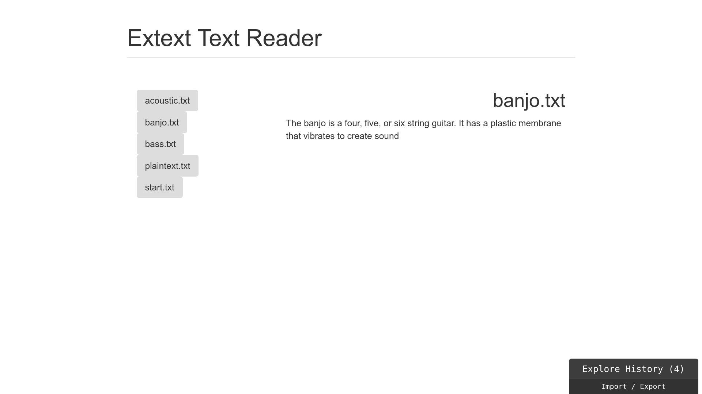

# Sam Rogers

My implementation of the text browser takes the form of an [Elixir](http://elixir-lang.org)
web application with a frontend made in [Elm](http://elm-lang.org). Both languages are
relatively recent, though Elixir runs on the BEAM virtual machine that also powers the
more-established Erlang.

## How It Works

The application has a distinct front end and back end implemented in different
languages. These components are bundled for deployment by the [Phoenix](http://phoenixframework.org)
web framework.

On the back end, an Elixir application scans specified directories on its host filesystem for files
with a `.txt` or `.TXT` extension. It makes the names and contents of these text files available via
a `JSON` API.

On the front end, an Elm application consumes the `JSON` information. It makes a table of contents
from the filenames, where each entry is a button with the filename as its text. When the user clicks
a button, the associated file is displayed in a `
`.

## Looking Back

Implementing the project in Elixir and Elm presented particular challenges.
(Not least among them is the fact that I started learning Elm specifically for this project!)

By delving deep into the reasoning behind language design choices, I discovered ways in which
both languages made it easy to build features from pipelines of encapsulated operations. The
resulting code is extremely easy to test, as well as to extend and tweak without disrupting
other steps in any given operation.

Elixir and Elm are primarily functional and require a specific rethinking of the "naïve"
approach that I would have used in an object-oriented language. This is a strength of functional
languages in general. In fitting specifications to the language paradigm, the programmer develops
 a rigorous understanding of the problem. For me this often results in a clearer model of the
 problem itself in relation to computation.

The back end logic required relatively little effort, and it would not take much to adapt
it to a more useful/general application. I saw my work quickly dominated by user interface concerns.
Elm forced me to optimize the model of the data my interface had to display. This constraint,
a result of the fact that Elm components are stateless, had the side effect of illustrating where
I could simplify the API in the Elixir application.

## Language Choice

Other members of the group used other languages, which are considered in relation to Elixir and Elm
below:
 
 - As a scripting language, **Python** has more convenient APIs for filesystem operations than Elixir.
 Such APIs make it easier to flexibly configure the parameters for which files the application makes
 available.
 
 - The extremely flexible **C++** has all the features I used in Elixir, but I am glad I did not
 use it myself. It would have lead me to model the problem differently, and also quite likely to
 make a less general and more tightly-coupled user interface.
 
 - Given its Apple pedigree, it is almost certain that **Swift** would have made building a GUI far
 easier. Aside from portability and access to the toolchain, there are no factors that make me prefer
 Elixir/Elm, C++, or Python over Swift.
 
 - Among the languages we used, **R** has the most similarities to Elixir. In particular, both are
 designed for advanced users whose applications must process large quantities of data, requests, etc.
 Neither lends itself to straightforward building of interfaces for end users in the way, e.g. Python
 or Java do with their inclusion of cross-platform GUI tools in their standard libraries.
 
 ## Screenshots
 
 
 
 